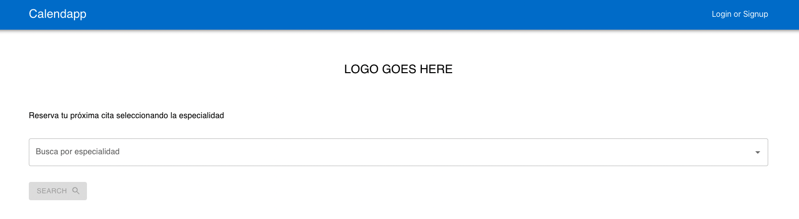
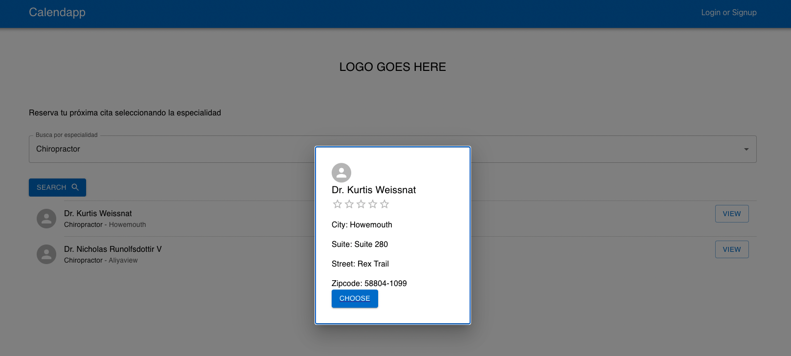
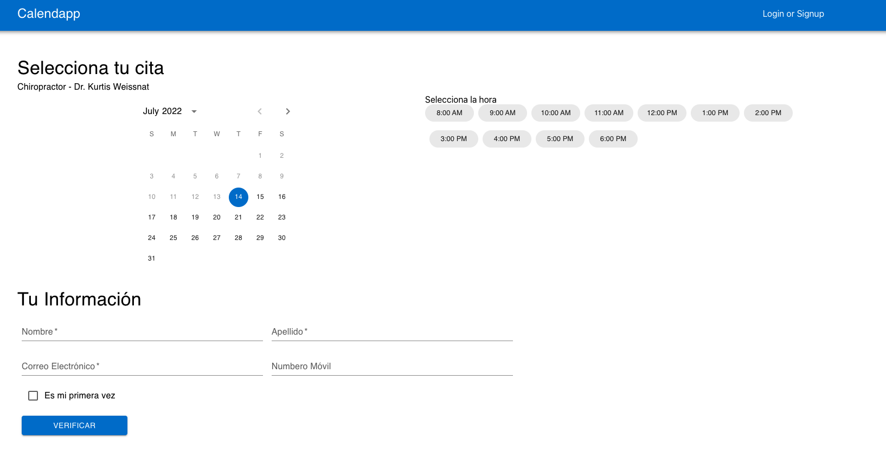
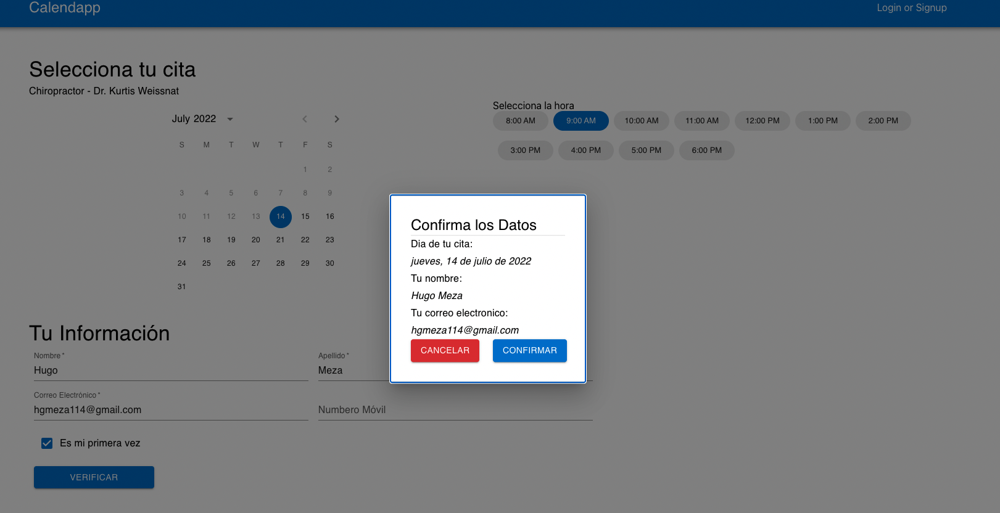
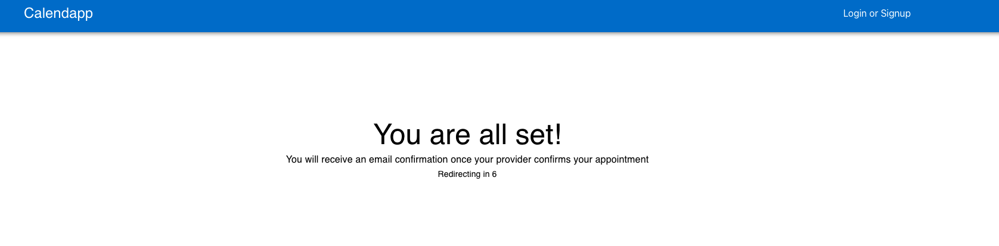

# Calendapp Client

Still a work in progress. Its main intention is to build an app that allows you to book doctors appointments. The main target audience is Latin America, so you will see some mix of Spanish and English here and there while this is being built.

## Demo

Check the live demo <a href="https://d284c5mvune0v7.cloudfront.net/">here</a>

## Views

### Home Page

Initial View

Selecting a Provider

### Book Page

Initial View

Data Confirmation

### Confirm

Initial View

## Technologies

React, React Query, Material UI
